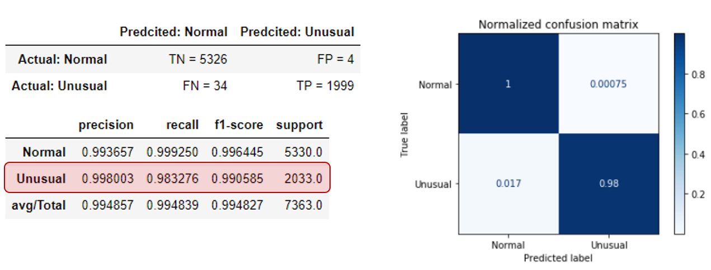
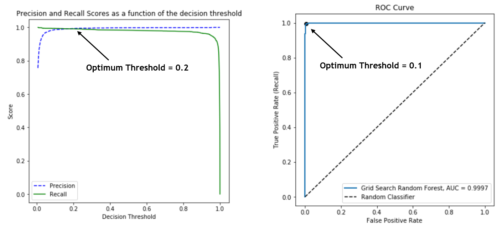
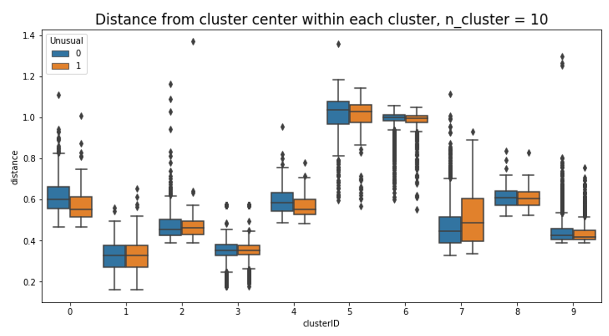

# Unsupervised and Supervised Anomaly Detection
Objectives of this project is to explore possibilities of ML to detect abnormal behaviors in the utilization of the network that would motivate a change in the configuration of the base station.
Network optimization is aimed to train an ML system capable of classifying current activity as:

* 0 (**Normal**): normal behavior of any working day
* 1 (**Unusual**): deviation from typical activities due to strike, demonstration, sports event, etc. which should trigger a  reconfiguration of the base station

The dataset has been obtained from a real LTE deployment. During two weeks, different metrics were gathered from a set of 10 base stations, each having a different number of cells, every 15 minutes. It can be downloaded from the following [link](https://www.kaggle.com/c/anomaly-detection-in-cellular-networks/overview) on Kaggle.


My anomaly detection methodology included following steps: 

* Exploratory Data Analysis was conducted to investigate distribution of unusual cases,
correlation between feature variables, and how to deal with non-quantitative features and missing values
* PCA and t-SNE Analysis conducted to investigate clustering
* Supervised Classification Modeling: XGBoost with optimized parameters provided excellent prediction
* Unsupervised anomaly detection: multiple methods were implemented and optimized for improved  performance


## Project Structure and Sections

###Exploratory Data Analysis
Exploratory Data Analysis was conducted to investigate the relationship between different features and visualize distribution of unusual cases. Multicollinearity was investigated and features with large Variation Inflation Factor (VIF) were dropped from dataset. Feature Selection was conducted using Z-test and significance level of 0.05 (two tailed test)
PCA and t-SNE Analysis indicated not clear clusters nor a clearly defined pattern

###Supervised Classification Modeling
Supervised classification modeling was performed using XGBoost algorithm. Parameters optimized for highest recall using a cross-validated grid-search over a parameter grid
XGBoost demonstrated exceptional prediction power to classify unusual activities. Following is the confusion matrix of the classification results:


Threshold was adjusted to minimize the FN. Optimal threshold was identified using both precision-recall curve (highest F1-score) and ROC curve (plot of hit rate vs false alarm rate) as shown here




###Unsupervised anomaly detection
Unsupervised anomaly detection conducted using K-means Clustering. The prevalence of unusual points in each cluster was investigated to estimate possibility of an unseen point being unusual if being assigned to this cluster.  Distance from cluster center for the data points within each cluster is calculated and categorized based on normal and unusual activities as shown in the following plot:


A function was defined to output average and standard deviation of distance (from cluster center) for unusual point for each cluster. The probability of a new datapoint being unusual is defined as a product of prevalence of unusual points by probability in normal distribution given mean (mu) and standard deviation (std) of distance in each cluster. Results with 1% significance level to identify unusual activities on a test set indicated promising results that needs to be improved Comparable results were achieved using both original scaled features and reduced features ( 4 components of PCA)


## Dependencies
* Pandas
* Numpy


How to use?
===========
The project is developed in Jupyter Notebooks which is automatically rendered by GitHub. The developed codes and functions for each step are explained in the notebook.










